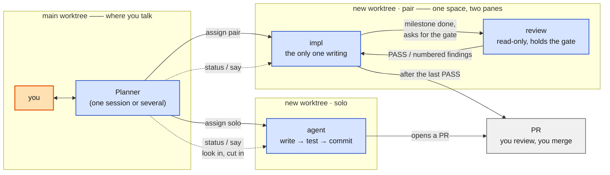

# foreman

**A workflow for handing work out.** You settle a plan in your main worktree, `foreman` sends
it into a git worktree of its own, agents work there until a PR exists, and you review and
merge.

Your main worktree is never touched by anyone else, several jobs run genuinely in parallel,
and each one keeps its progress, its conversation and its diff in its own window. Underneath
is [herdr](https://github.com/): workspaces, panes, agents.



Two modes:

- **solo** — one agent, start to finish. Small, unambiguous work.
- **pair** — two agents in one worktree: `impl` writes, `review` is **read-only and holds the
  gate**. impl stops at each milestone to ask for the gate and continues only on PASS; no PR
  before the last one. Anything needing a human call — scope, public contracts, design
  trade-offs — neither settles alone; review raises it with you.

## Install

```bash
git clone <this repo> ~/src/foreman && cd ~/src/foreman && ./install.sh
```

Symlinks `bin/foreman` into `~/.local/bin` and `skill/` into every agent framework you have
(`~/.claude/skills` and `~/.codex/skills` share one SKILL.md), then seeds `local/` from
`examples/`. Idempotent.

Needs `python3 >= 3.11` and `herdr`; `gh` is optional (the PR/CI column of `status` uses it).

## Setup

**All real config lives in `local/`, which is gitignored** — editing it never produces a dirty
diff and never fights `git pull`. `install.sh` seeds an annotated copy the first time; edit
that:

```
foreman/
├─ bin/foreman
├─ install.sh
├─ templates/                      the shipped prompts: solo · pair-impl · pair-review
├─ examples/                       annotated samples; whatever local/ lacks is seeded from here
│
├─ local/                          ★ the only layer you touch
│  ├─ foreman.toml                 which agent each mode defaults to: kind / model / effort / tier
│  ├─ <project>.toml               where main is, where new worktrees go, per-role notes, hook.
│  │                               One per project; add more and you can dispatch more projects
│  ├─ <project>-post-worktree.sh   the one hook: runs after the worktree exists, cwd inside it
│  ├─ <project>-worker-env.sh       optional: sourced before every Agent Session and restart
│  └─ templates/                   (optional) override the shipped prompts, see Prompts below
│
└─ state/jobs/<task>.json          one ledger per job, written by foreman; ignore it
```

`git worktree add` brings no submodules, no `.venv`, no untracked local files — restoring
those **is written only in that hook script** (a non-zero exit aborts the dispatch). It is
also the thing to run when you create a worktree by hand, which is why the steps should not be
repeated in your project docs.

Use `[hooks].source_env` for exports and shell functions that must be inherited by the agent.
Foreman sources it in the pane after worktree setup and before `herdr agent start`, and repeats
that initialization on `foreman restart`.

`solo_notes`, `impl_notes` and `review_notes` in `<project>.toml` are free text and go into
that role's opening prompt verbatim — point at the project's own rules file (**point, don't
copy**) and add the commands that file doesn't already give you. One key per role and no
shared fallback, so review can be told something impl isn't; a key you leave out means that
role gets no notes and its heading disappears.

## Usage

```bash
foreman assign pair --plan docs/plans/13-installed-surface-smoke.md
foreman assign solo --prompt "replace X with Y" --task chore-xy

# Pi can use either provider without changing the mode default:
foreman assign solo --prompt "replace X with Y" --task chore-xy \
  --kind pi --model anthropic/<claude-model-id> --effort xhigh
foreman assign solo --prompt "replace X with Y" --task chore-xy \
  --kind pi --model openai-codex/<gpt-model-id> --effort xhigh

foreman assign pair --plan <file> --dry-run    # see what it would do, and the exact prompts
```

`--kind pi` is a per-dispatch override; it does not change `[modes.solo.agent]`.
Pi accepts `provider/model` through Foreman's existing `--model` option, so Claude and GPT
selection stays explicit. Omit `--model` to let Pi use its own saved provider/model.

Pick the mode first, then that mode's flags (`solo` never shows `--review-*`). The work itself
is `--plan <file>` or `--prompt "one sentence"`. It reports both pane ids when it's done.

The remaining four are self-explanatory under `foreman --help`: `say` (message an agent),
`status` (who is paired with whom, PR and CI), `restart` (restart one role in place), `done`
(wrap up).

## Prompts — changing what an agent is told

Everything a dispatched agent knows arrives in one opening prompt, rendered from a template.
Four of them:

```
templates/solo.md            the lone agent
templates/pair-impl.md       "you are impl"
templates/pair-review.md     "you are review"
templates/pair-protocol.md   the gate loop — spliced into both pair roles, so it can't drift
```

The role templates are short and say only **who you are**; the protocol holds **how the two of
you work together**. Rendered, a prompt reads: identity (your pane and your partner's) → the
task → `## Role` → `## Collaboration` → `## Notes`. The last one is the free text from your
project toml — `{solo_notes}`, `{impl_notes}` or `{review_notes}`, one per template, so the
three can be overridden apart; leave one empty and its heading disappears.

To change any of it, drop an edited copy into a layer that outranks the shipped one:

```
local/templates/<project>/pair-impl.md    this project only
local/templates/pair-impl.md              this machine
templates/pair-impl.md                    shipped default
```

So `cp templates/pair-protocol.md local/templates/` and edit is how you rewrite the gate
protocol for every project on this machine. `--dry-run` prints which file it ended up using,
and the full rendered prompt.
